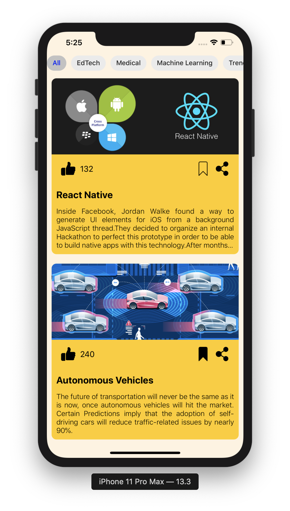
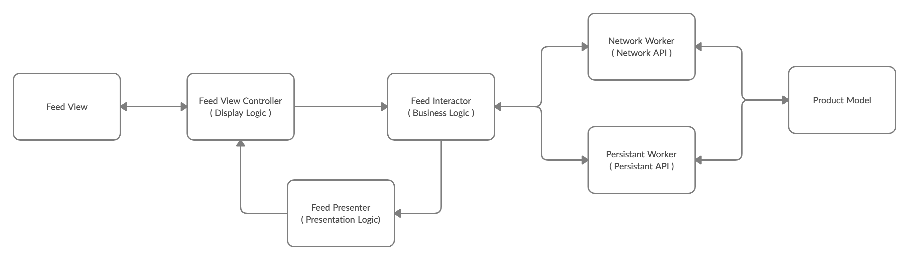
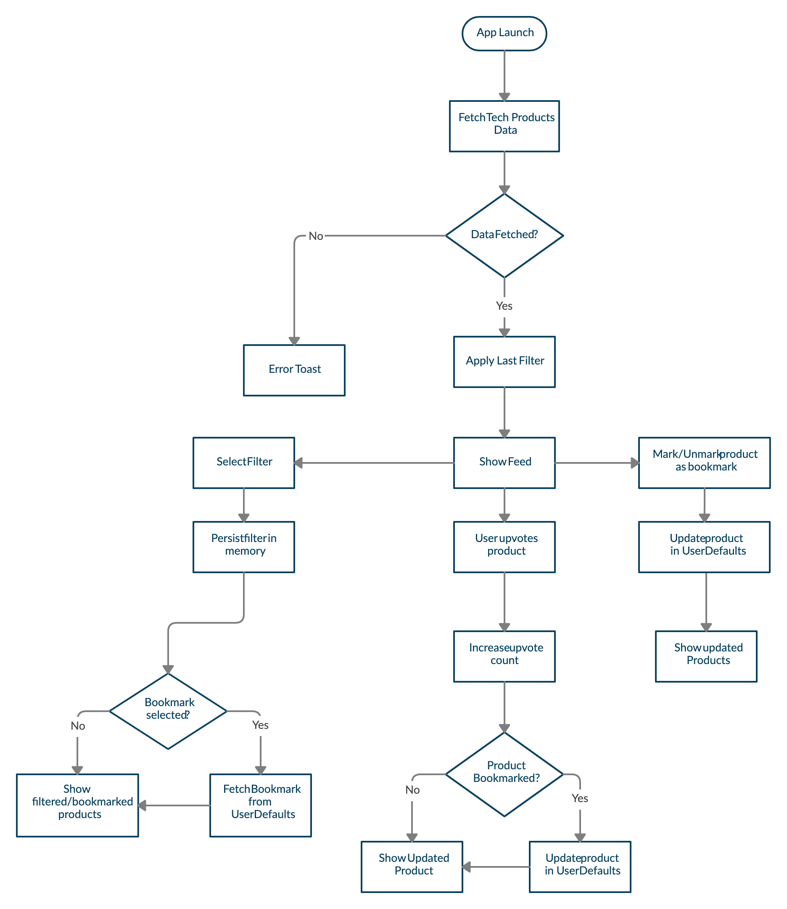

# Tech Product Feed

An iOS application which contains a curated feed of trending tech products and innovations happening across the world. A user can browse through the large set of products inside the feed and read in-detail about every tech product. A user can upvote a product, bookmark it and share it through social media. There are some quick filters to help users filter out the best content based on the user's preferences.  

# Steps to Run

  - Open terminal in project folder where **Podfile** is stored.
  - Run **pod install**.
  -  Open .xcworkspace file in project folder with xcode.

# Clean Swift Architecture

- **View Controller** holds various views and display logic for rendering data into them.
- **Presenter** holds the presentation logic for passing view models to **View Controller**.
- **Interactor** contains whole business logic for responding to requests raised by **View Controller**. Hosts various **Workers** for different tasks such as calling Network API, saving data into Persistant API.
- All these logics are represented using Protocols.

# App Flow
- User launches app, latest tech products gets fetched and displayed to on screen. Previous filter is any is applied.
- On selection of different filters, products get filtered and current filter option is stored in persistant store for later usage.
- Bookmarking a product save the product in persistant store and mark the current product as bookmarked to show icon change.
- On upvote product's upvote count increase and if that product is bookmarked changes are forwarded to persistant store as well.
- Products can be shared using share button which opens Share sheet.
- Image caching is implemented using URLCache and NSCache.
- All product data is read from **model.json** via Network Worker.
- All data storing and retrieval in persistant store is done via Persistant Worker.
- Workers are implemented using Adapter pattern.

# CocoaPods Used

- [MaterialComponents/Chips](https://material.io/develop/ios/components/chips) 
	 > For creating view of individual filters in a collection view.
